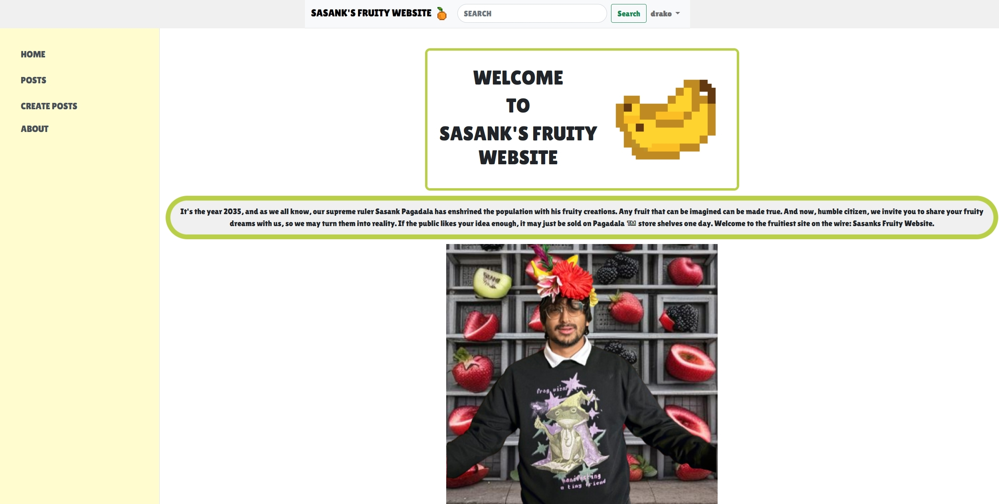
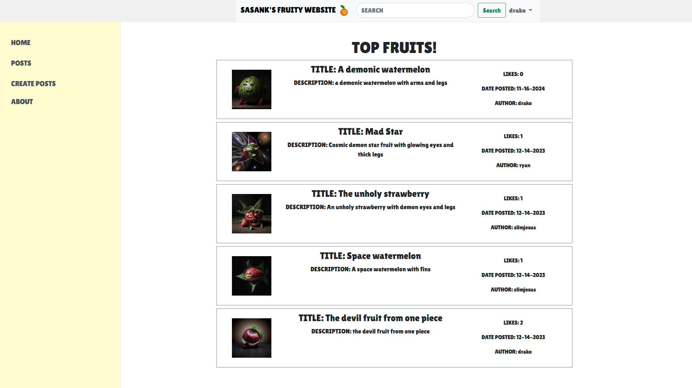
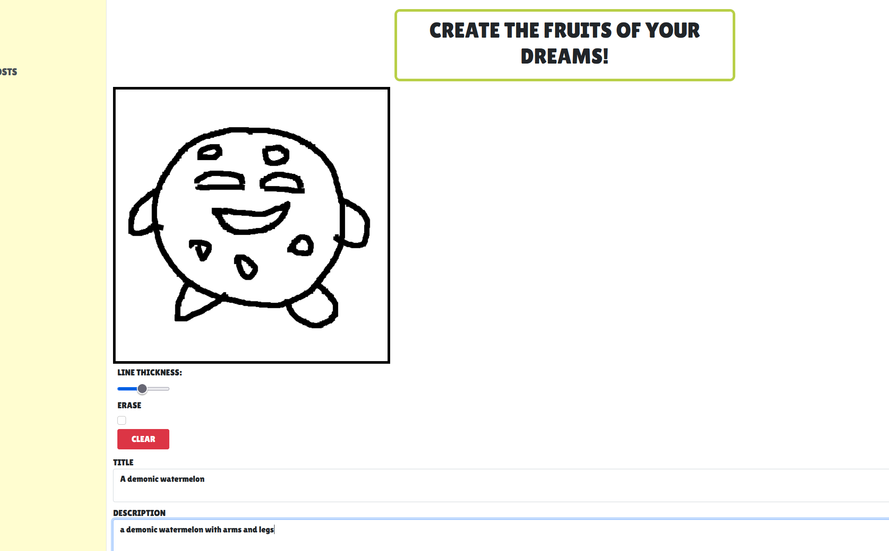
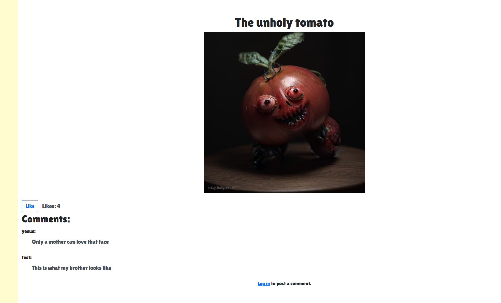
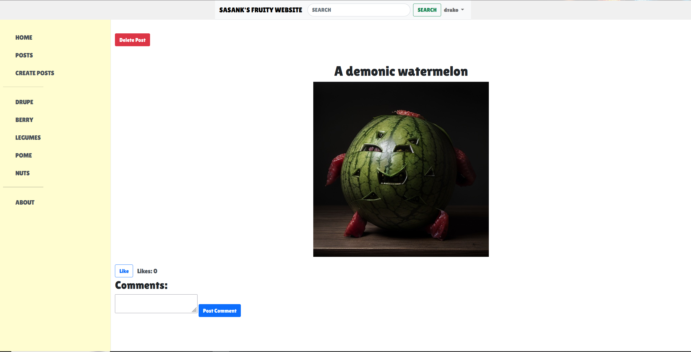
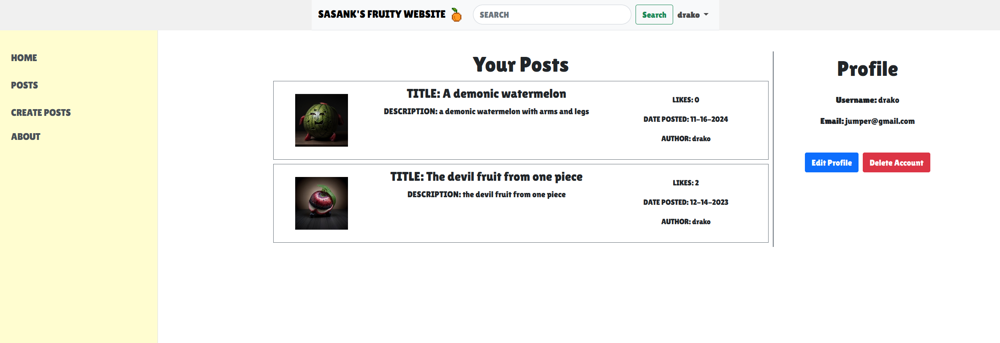
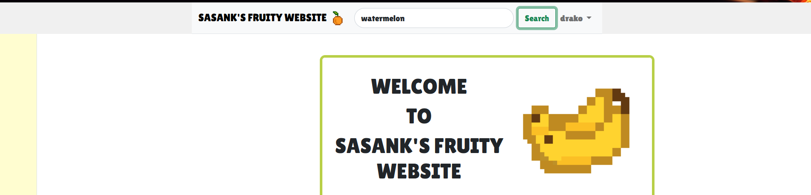
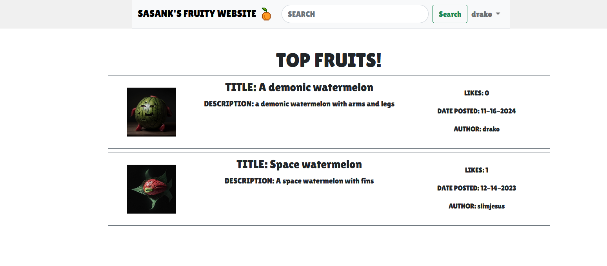
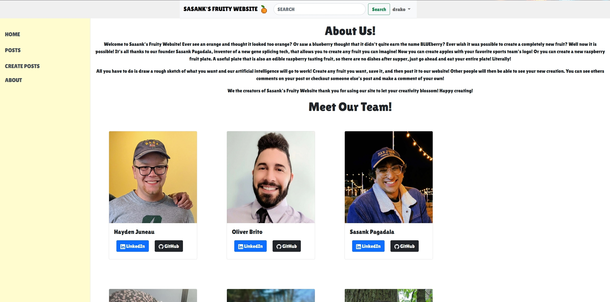
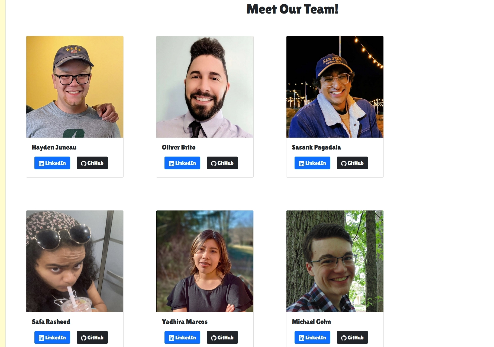

# Sasank's Fruity App 🍎🍌🍇

Sasank's Fruity App is a creative forum where users can design and describe their own fruits! Using cutting-edge AI, users can sketch and describe their fruit ideas, which are then brought to life and posted on the forum for others to vote and comment on. Unleash your imagination and create the fruit of your dreams!

---

## **Table of Contents** 📋

1. [Team Fruit 🍍](#team-fruit-)
2. [Tech Stack 🛠](#tech-stack-)
3. [Team Workflow 📅](#team-workflow-)
4. [Screenshots Overview 🖼](#screenshots-overview-)
   - [Home Page](#home-page)
   - [Posts Page](#posts-page)
   - [Create Posts Page](#create-posts-page)
   - [Post View Page](#post-view-page)
   - [Post View Page Cont.](#post-view-page-2)
   - [Profile Page](#profile-page)
   - [Search Page](#search-page)
   - [Search Results Page](#search-results-page)
   - [About Page](#about-page)
   - [About Page Cont.](#about-page-cont)
5. [How to Run the App 🚀](#how-to-run-the-app-)
6. [Links 🔗](#links)

---

## **Team Fruit 🍍**
- **Sasank Pagadala** - President of Fruit  
- **Oliver Brito** - Resident Fruit Expert  
- **Safa Rasheed** - CEO of Apples  
- **Michael Gohn** - Senior Taste Tester  
- **Hayden Juneau** - Hedge Fruit Owner  
- **Yadhira Marcos-Avila** - Software Engineer  

---

## **Tech Stack 🛠**
- **Database**: PostgreSQL  
- **ORM**: SQLAlchemy  
- **Backend**: Python & Flask  
- **Hosting**: Render  
- **AI Models**:  
  - Stable Diffusion API (using ControlNext)  
  - ICBINP AI Model  

---

## **Team Workflow 📅**
- **Methodology**: Scrum for sprint planning  
- **Communication Tools**: Discord for daily standups and meetings  

---

## **Screenshots Overview 🖼**

### **Home Page**

### **Posts Page**

### **Create Posts Page**

### **Post View Page**

### **Post View Page 2**

### **Profile Page**

### **Search Page**

### **Search Results Page**

### **About Page**

### **About Page Cont**

---

## **How to Run the App 🚀**

1. Clone the repository:
- git clone https://github.com/obrito00/FruityApp
- cd FruityApp

2. Install dependencies:
pip install -r requirements.txt

3. Set up the database:
- Install PostgreSQL and setup the DB connection
- Create the tables using the database_schema.sql
- Configure the PostgreSQL DB in the .env file refer to the .env_example

4. Run the application:
flask run

## Links
* [Github Repository](https://github.com/HaydenCJuneau/ITSC3155-final-project) - Source Control Platform where this project is hosted
* [Trello](https://trello.com/b/c0zP7y2g/sasanks-fruity-scrum-board) - Collaboration board where the team tracks PBIs
* [Figma](https://www.figma.com/file/qnwMUQIV9VHw6irGzwdyWM/Untitled?type=design&node-id=0%3A1&mode=design&t=f7JbcYXRcYz5H0Me-1) - Mockup tool where the team constructs UI designs
* [Googe Drive](https://drive.google.com/drive/folders/1PlXdDE9od4yh8_hmPK0oulxiEjJVnUTN?usp=sharing) - Place to store larger documents and sprint notes

